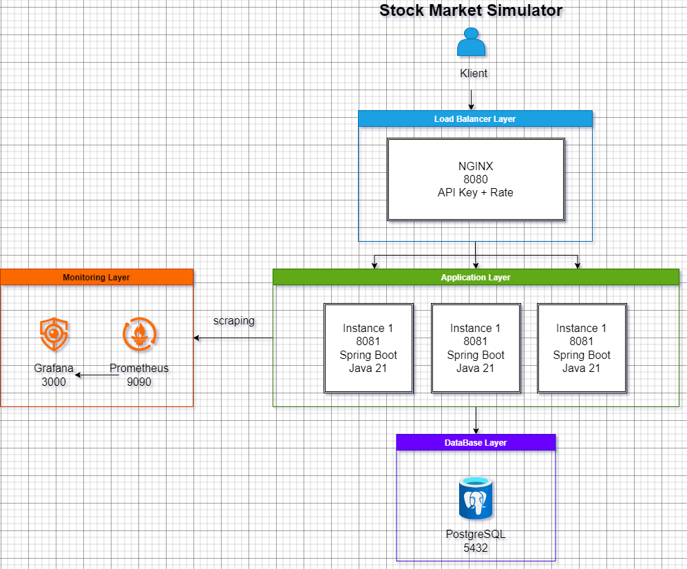

# Stock Market Simulator

[](https://adoptium.net/)
[](https://spring.io/projects/spring-boot)
[](https://www.postgresql.org/)
[](https://www.docker.com/)

A simplified stock market simulator built as a recruitment task for **Remitly Poland**.

The project implements the required REST API while also showing how the service can be structured in a way that feels close to a small production-ready backend.

---

## Highlights

* REST API with OpenAPI / Swagger documentation
* 3 Spring Boot instances behind NGINX
* Shared PostgreSQL database
* Prometheus + Grafana monitoring
* GitHub Actions CI pipeline
* Docker one-command startup
* Audit log for successful wallet operations
* Retry handling for concurrent requests

---

## Architecture



### Main Components

| Component      | Responsibility                                    |
| -------------- | ------------------------------------------------- |
| NGINX          | Load balancing, API key validation, rate limiting |
| Spring Boot    | Business logic and REST API                       |
| PostgreSQL     | Shared persistence                                |
| Prometheus     | Metrics collection                                |
| Grafana        | Metrics visualization                             |
| GitHub Actions | Automated build and tests                         |

---

## Technology Stack

| Area           | Technology                        |
| -------------- | --------------------------------- |
| Language       | Java 21                           |
| Framework      | Spring Boot 3                     |
| Database       | PostgreSQL 16                     |
| API Docs       | Springdoc OpenAPI                 |
| Monitoring     | Micrometer + Prometheus + Grafana |
| Infrastructure | Docker + Docker Compose           |
| CI             | GitHub Actions                    |

---

## Quick Start

### Clone the repository

```bash
git clone https://github.com/Michael21Official/stock-market-simulator.git
cd stock-market-simulator
```

### Start the application

The startup script accepts the HTTP port as a parameter so the application can run on any required port.

General usage:

```bash
./start.sh XXXX
```

Example:

```bash
./start.sh 8080
```

After startup, the API will be available at:

```bash
http://localhost: XXXX
```

For the example above:

```bash
http://localhost:8080
```

### Stop the application

```bash
docker-compose down
```

---

## Available Services

| Service      | URL                                           |
| ------------ | --------------------------------------------- |
| Main API     | `http://localhost:8080`                       |
| Swagger UI   | `http://localhost:8080/swagger-ui/index.html` |
| OpenAPI JSON | `http://localhost:8080/v3/api-docs`           |
| Prometheus   | `http://localhost:9090`                       |
| Grafana      | `http://localhost:3000`                       |

### Grafana Default Login

```text
login: admin
password: admin
```

---

## Authentication

All business endpoints require the following header:

```http
X-API-Key: remitly-internship-2026-secret-key
```

### Public Endpoints

Available without an API key:

* `/actuator/health`
* `/actuator/prometheus`
* `/swagger-ui/**`
* `/v3/api-docs/**`

---

## API Endpoints

### Buy or sell stock

```http
POST /wallets/{walletId}/stocks/{stockName}
```

Request body:

```json
{
  "type": "buy"
}
```

or

```json
{
  "type": "sell"
}
```

### Get wallet

```http
GET /wallets/{walletId}
```

### Get stock quantity

```http
GET /wallets/{walletId}/stocks/{stockName}
```

### Get bank state

```http
GET /stocks
```

### Set bank state

```http
POST /stocks
```

### Get audit log

```http
GET /log
```

### Simulate instance failure

```http
POST /chaos
```

---

## Example Usage

### Add stocks to the bank

```bash
curl -X POST http://localhost:8080/stocks \
  -H "Content-Type: application/json" \
  -H "X-API-Key: remitly-internship-2026-secret-key" \
  -d '{"stocks":[{"name":"AAPL","quantity":100}]}'
```

### Buy stock

```bash
curl -X POST http://localhost:8080/wallets/user1/stocks/AAPL \
  -H "Content-Type: application/json" \
  -H "X-API-Key: remitly-internship-2026-secret-key" \
  -d '{"type":"buy"}'
```

### Check wallet

```bash
curl -H "X-API-Key: remitly-internship-2026-secret-key" \
http://localhost:8080/wallets/user1
```

---

## Monitoring

The application exposes metrics through Spring Boot Actuator.

Example metrics:

* `trades_buy_success_total`
* `trades_sell_success_total`
* `trades_failed_total`
* `trades_duration_seconds`

Prometheus collects the metrics and Grafana displays them.

---

## Testing

Run all tests:

```bash
./mvnw test
```

Run integration tests only:

```bash
./mvnw test -Dtest="*IntegrationTest"
```

---

## Continuous Integration

GitHub Actions automatically runs on every push:

* source checkout
* Java setup
* dependency cache
* unit tests
* integration tests
* Maven package
* Docker image build

Workflow file:

```text
.github/workflows/ci.yml
```

---

## How I Approached This Task

My first idea was to build the smallest possible version of the API.
After a short time, I decided it would be better to use the task as a chance to show a fuller engineering approach.

Instead of only implementing the endpoints, I focused on:

* clean project structure,
* predictable behaviour,
* easy deployment,
* and visibility into the system.

That is why the project includes not only the required functionality, but also monitoring, CI, and infrastructure around it.

---

## Design Decisions

### Why PostgreSQL?

Because multiple application instances need to share the same data.
PostgreSQL provides:

* transaction safety,
* consistent shared state,
* reliable concurrent updates.

### Why NGINX?

NGINX handles infrastructure concerns outside the application:

* load balancing,
* API key validation,
* rate limiting.

This keeps the Spring Boot application focused only on business logic.

### Why event-based audit logging?

The audit log should only contain successful operations.
Using transaction events ensures failed requests are never stored.

---

## Possible Improvements

* add `restart: unless-stopped` in `docker-compose.yml` to automatically recover killed instances
* store API keys in a secret manager (Hashicorp Vault, AWS Secrets Manager)
* replace NGINX with a cloud load balancer (AWS ALB, GCP Cloud Load Balancing)
* use Kubernetes instead of Docker Compose for production-grade orchestration

---

## Author

**Michał Matsalak**

GitHub:
[https://github.com/Michael21Official](https://github.com/Michael21Official)
